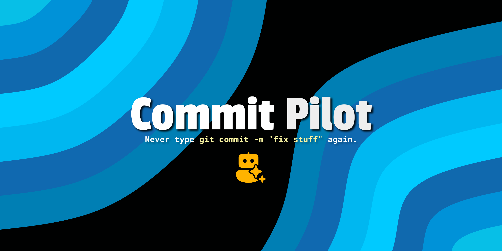

#  [Commit Pilot](https://nisrulz.com/commit-pilot/)

Never type `git commit -m "fix stuff"` again.

Commit Pilot reads your uncommitted changes, groups related files, and writes
conventional commit messages through LM Studio (default), Ollama, Unsloth
Studio, or any OpenAI-compatible API. Local-first and zero telemetry: diffs go
only to the provider you configure, so with a local provider they never leave
your machine.



📖 Read the story: [I Hate Writing Commit Messages, So I Built Commit Pilot](https://crushingcode.nisrulz.com/blog/i-hate-writing-commit-messages-so-i-built-commmit-pilot/)

## Features

- **Conventional commits, no thinking required.** Groups related files and writes `feat:`, `fix:`, `chore:` subjects with focused bodies.
- **Local-first.** Diffs stay on your machine with LM Studio, Ollama, or Unsloth Studio.
- **Zero telemetry.** No analytics, no callbacks. Project config cannot change where your diff is sent.
- **Handles large diffs.** Batches files and chunks oversized ones across multiple LLM calls.
- **Plan before you commit.** Review or edit the plan first; `--plan-lint` validates edited plans.
- **Sensitive by default.** Skips files that look like secrets, keys, or certificates. `--include` and `--exclude` control exactly what reaches the model.

## Quick start

```bash
curl -sfL https://github.com/nisrulz/commit-pilot/releases/latest/download/install.sh | sh
```

Then, with LM Studio running:

```bash
commit-pilot
```

That's it. Review the proposed commits and press enter. No Go needed; `make
install` works from source with Go 1.25+. The installer verifies a SHA-256
checksum before installing.

## Providers

`OPENAI_PROVIDER` picks your backend: `lmstudio` (default), `ollama`, `unsloth`,
`openai`, or `custom`. Guides: [LM Studio](docs/lmstudio.md) · [Ollama](docs/ollama.md) · [OpenAI](docs/openai.md) · [Unsloth Studio](docs/unsloth.md)

## Dig deeper

- [Usage](docs/usage.md): configuration, plan review, flags, custom prompts
- [How it works](docs/how-it-works.md)
- [Development](docs/dev.md)

## License

[](LICENSE)
