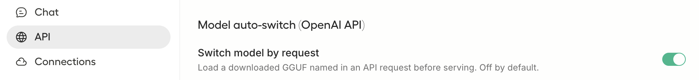

# Unsloth Studio

Unsloth Studio is a local, OpenAI-compatible server. Point the `openai_compat`
provider at it with a `base_url`.

## Install

Follow the instructions at [unsloth.ai](https://unsloth.ai) to install Unsloth Studio.

## Load a model

```bash
unsloth run --model unsloth/LFM2.5-8B-A1B-GGUF -p 8888
```

This is the same model as Ollama's `lfm2.5:8b`, in Unsloth's dynamic-quant
format. Or open the Unsloth Studio UI, load a GGUF model via New Chat, and
create an API key from **Settings → API**.

## Enable automatic model loading

Unsloth Studio keeps models unloaded until you start a chat. The first API
call fails with:

```
No model loaded. Call POST /inference/load first.
```

Now, that is an issue 🤔. The fix is quite simple though. Turn on **Model
auto-switch** under **Settings → API**. Unsloth Studio then loads the requested
model on the first API call, and commit-pilot just works.



## Configure commit-pilot

Commit Pilot reads the API key from the `COMMIT_PILOT_OPENAI_COMPAT_API_KEY`
environment variable, never from a config file or the command line. That keeps
it out of shell history. Export it from a secret manager or your shell profile:

```bash
export COMMIT_PILOT_OPENAI_COMPAT_API_KEY=sk-unsloth-...
```

Add to your config file (`~/.config/commit-pilot/config.yaml`):

```yaml
provider: openai_compat
base_url: http://localhost:8888/v1
model: unsloth/LFM2.5-8B-A1B-GGUF
```

Unsloth Studio's API is key-protected, so `--doctor` reports reachability for
the server and keeps the model check separate. You can confirm the server is
running even before the key is configured; the key is still required for actual
model calls.

Check the server and available model names:

```bash
commit-pilot --doctor
commit-pilot --list-models
```

For a different API base:

```yaml
base_url: http://localhost:8000/v1
```

## Run commit-pilot

```bash
commit-pilot
```
